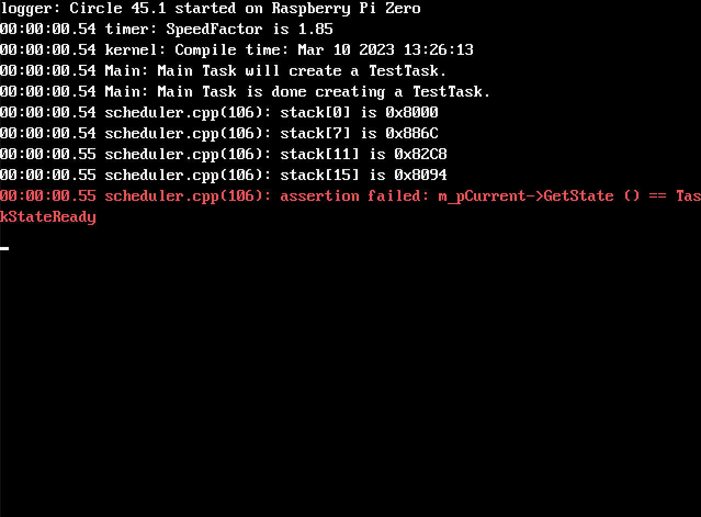
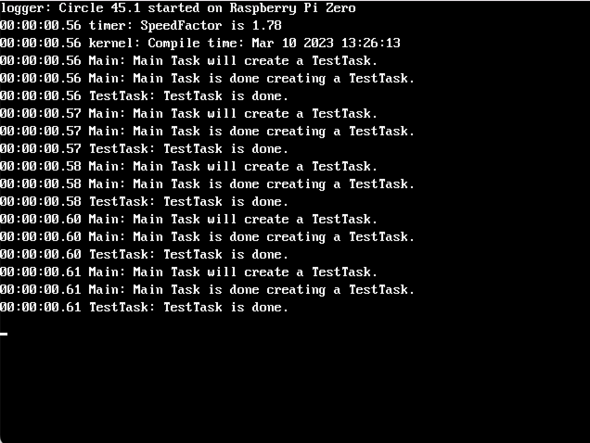
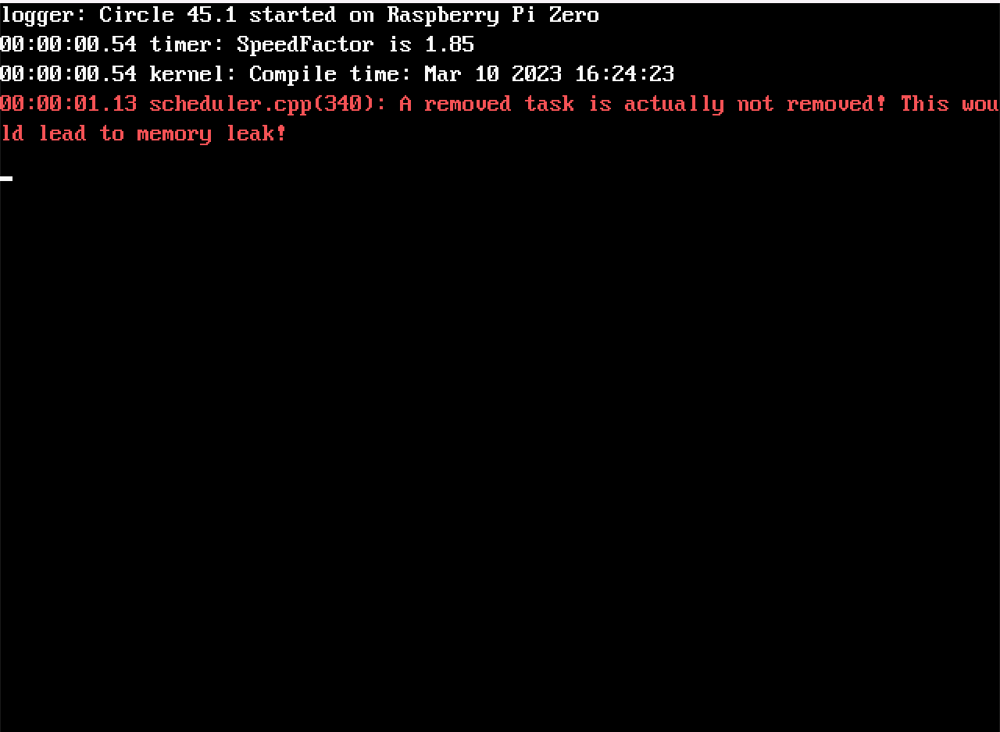
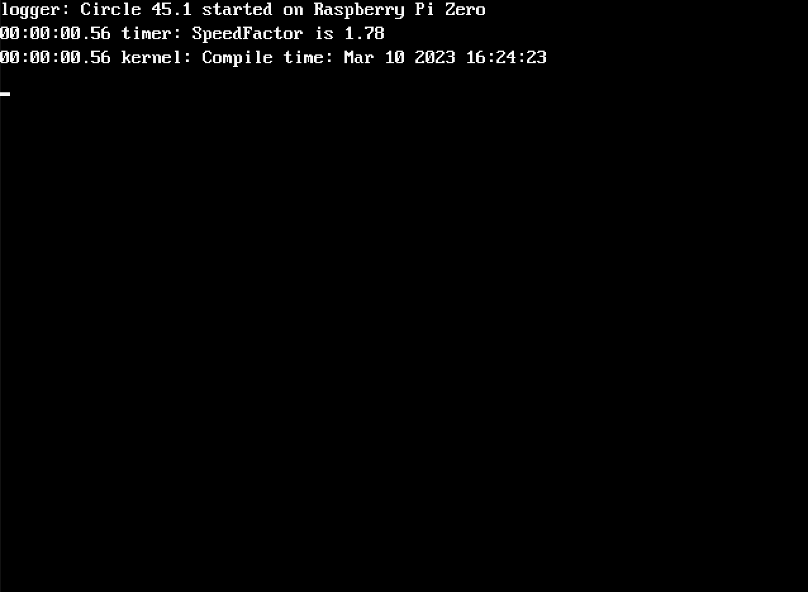

# Project 3: Preemptive Multitasking + Cooperative Multitasking 

## What are we doing in this project?
In this project, we will try to combine cooperative multitasking (which we have studied in project 1) and preemptive multitasking (which we have implemented in project 2).
- Q: Why would we want to combine them?
- A: We want to combine them because we want to have both of their advantages.
	- Cooperative multitasking gives a task the ability to proactively trigger a context switch (by directly or indirectly calling `Yield`), which is the basis for useful operations like `Sleep` and `Wait` .
		- `Sleep` is useful because without it a task will have to go into in a while loop and busily check if a specified time has passed before it breaks out of the loop.
			- If you are curious about how `Sleep` makes use of `Yield`, have a look at the implementation of [`usSleep`](../../lib/sched/scheduler.cpp#L106-L121).
		- `Wait` is useful because it allows for [event-based synchronization](https://en.wikipedia.org/wiki/Event_(synchronization_primitive)) among tasks.
			- If you are curious about how `Wait` makes use of `Yield`, have a look at the implementation of [`Wait`](../../lib/sched/synchronizationevent.cpp#L80-L86) and [`BlockTask`](../../lib/sched/scheduler.cpp#L283-L338).

	- Preemptive multitasking gives a task the freedom of not having to periodically call `Yield` (for the sake of multitasking), which greatly simplifies the programming of a task.

## Specifically, we are trying to solve the following two problems:

### Problem 1: Rewrite `Yield` so that it becomes compatible with the context switch design of project 2.
- Currently, when we run this sample, it will crash because `Yield` is not implemented:

- After we have implemented `Yield` correctly, the sample should run showing task `Main` is repeatedly creating `TestTask`s and each `TestTask` is exiting shortly after being created:

#### Specifically, to solve problem 1, you are supposed to do the following:
- Read the definition of [`Yield` in `scheduler.cpp`](../../lib/sched/scheduler.cpp#L60-L63).
- Implement the [`TODO`s in `taskswitch.S`](../../lib/sched/taskswitch.S#L26-L43).
	- **Note**: This step depends on project 2's solution so you need to first copy project 2's solution to [here](../../lib/exceptionstub.S#L127-L129) and [here](../../lib/sched/scheduler.cpp#L509-L511). 
	- Hint: You probably will need to use the following assembly instructions:
		- `cps` for switching into IRQ mode and disabling IRQ interrupt
		- `mrs` for reading the value of `cpsr` register

### Problem 2: Identify and protect critical sections (in `scheduler.cpp`) in which IRQ interrupts should be temporarily disabled (because we don't want preemptive multitasking to occur in those critical sections).
- Before solving problem 2, make sure you have done the following:
	- You have finished solving problem 1.
	- You have deleted or commented out [this macro in common.h](common.h#L4)
- Now, when we run this sample and wait for a while, an error will show up:

- After we have identified and protected critical sections in `scheduler.cpp`, the error should never show up again no matter how long this sample runs:

## Specifically, to solve problem 2, you are supposed to do the following:
1.  Understand the following code design decisions:
	- The array `m_pTask` is used to store tasks managed by the scheduler.
	- All elements of `m_pTask` are initialized to 0 when the scheduler starts (see [here](../../lib/sched/scheduler.cpp#L40-L42)).
	- The variable `m_nTasks` is an integer used to mark the range of `m_pTask` that is actually being used. 
		- In other words, tasks can only be stored in the range `m_pTask[0, m_nTasks-1]`.
	- When a slot in `m_pTask[0, m_nTasks-1]` is storing a task, it will be non-zero; otherwise, it will be 0.
	- When we are trying to add a new task, we will first search for an empty slot in `m_pTask[0, m_nTasks-1]` to store the new task; if none is found, we will allocate an empty slot by incrementing `m_nTasks` (see [here](../../lib/sched/scheduler.cpp#L214-L238)).
	- On every IRQ interrupt that leads to a context switch, we will call `GetNextTask`.
	- In `GetNextTask`, we will do the following:
		- Do a sanity check on `m_pTask[m_nTasks, MAX_TASKS]` to make sure all slots are 0 (see [here](../../lib/sched/scheduler.cpp#L336-L343)).
		- Remove terminated tasks in `m_pTask[0, m_nTasks-1]`. Specifically, when a task is removed from a slot, we will set the slot to 0 (see [here](../../lib/sched/scheduler.cpp#L345-L366)).
		- If more than half of the tasks were removed, we will compact the array `m_pTask` and update `m_nTasks` (see [here](../../lib/sched/scheduler.cpp#L369-L389)).
1. Find out what race condition could occur in `scheduler.cpp` (due to the above code design decisions) and cause the error we are seeing in problem 2. 
1. Identify the critical section in `scheduler.cpp` where the race condition occurs, and write code to prevent that race condition from happening.
	- Hint: You probably will need to call [`EnableIRQs` and `DisableIRQs`](../../include/circle/synchronize.h#L46-L47).

## What to submit on ELMS before your lab in the week of Apr 3 (you have 2 weeks + 1 week of spring break):
1. A pdf that has:
	- Members of your group.
	- A screenshot/photo that shows problem 1 is solved.
	- A screenshot/photo that shows problem 2 is solved.
1. The file `taskswitch.S` in which you have implemented the `TODO`s under the label `TaskSwitch` for sovling problem 1.
1. The file `scheduler.cpp` in which you have written code to prevent some race condition from happening for solving problem 2.

## Documents for reference
- [1] [ARM Architecture Reference Manual](https://documentation-service.arm.com/static/5f8dacc8f86e16515cdb865a)
- [2] [ARM1176JZF-S Technical Reference Manual](https://developer.arm.com/documentation/ddi0301/latest/)
	- ARM1176JZF-S is the processor used in Raspberry Pi Zero according to [here](https://www.raspberrypi.com/documentation/computers/processors.html).
	-  **NOTE: This ARM processor supports two ISAs -- the original [ARM ISA](https://en.wikipedia.org/wiki/ARM_architecture_family#Instruction_set), which we will be using for this project, and [Thumb ISA](https://en.wikipedia.org/wiki/ARM_architecture_family#Thumb). When we read these documents, we only need to read texts that are relevant to ARM ISA (texts that mention "ARM state") not thumb ISA (texts that mention "thumb state").**
		- For example, when trying to learn what registers are available to us, we should read the section ["The ARM state core register set"](https://developer.arm.com/documentation/ddi0301/h/programmer-s-model/registers/the-arm-state-core-register-set?lang=en) instead of the section ["The Thumb state core register set"](https://developer.arm.com/documentation/ddi0301/h/programmer-s-model/registers/the-thumb-state-core-register-set?lang=en)
- [3] [ARM Procedure Call Standard](https://developer.arm.com/documentation/dui0041/c/ARM-Procedure-Call-Standard)

